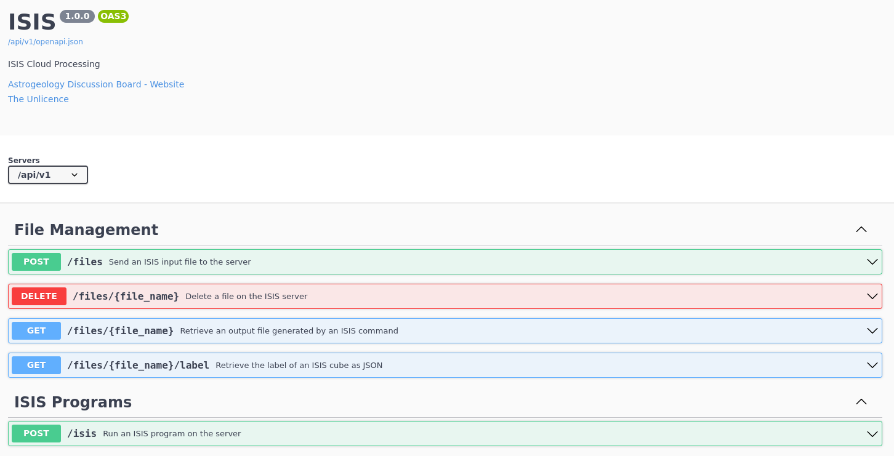

# ISISCloud
A project to make ISIS processing cloud-ready

- [Server](./isis_cloud/server/_app.py): A [Connexion](https://connexion.readthedocs.io)
Flask server with OpenAPI documentation. The documentation is hosted at /api/v1/docs when 
[wsgi.py](./wsgi.py) is running.
- [Client](./isis_cloud/client/_client.py) that wraps request generation

## Creating the app environment
```shell
conda env create -f environment.yml
conda activate isis
```

## Running the server
```shell
./wsgi.py
```

## API


## Example Requests
Uploading the MRO image J03_045994_1986_XN_18N282W.IMG, transforming it to an
ISIS cube, and downloading the result

### Curl
```shell
#!/bin/bash

# Download the input file from pdsimage2
curl -o J03_045994_1986_XN_18N282W.IMG \
  "https://pdsimage2.wr.usgs.gov/Missions/Mars_Reconnaissance_Orbiter/CTX/mrox_2578/data/J03_045994_1986_XN_18N282W.IMG"

# Upload the input file to the ISISServer
curl -F 'J03_045994_1986_XN_18N282W.IMG=@J03_045994_1986_XN_18N282W.IMG' \
  http://127.0.0.1:8080/api/v1/files
  
# Process the input file on the ISISServer
curl -H 'Content-Type: application/json' \
  -d '{"command": "mroctx2isis", "args": {"from": "J03_045994_1986_XN_18N282W.IMG", "to=mro.cub"}}' \
  http://127.0.0.1:8080/api/v1/isis
  
# Download the result
curl -o mro.cub http://127.0.0.1:8080/files/mro.cub
```

### isis_cloud.client.ISISClient

```python
from isis_cloud.client import ISISClient

input_url = "https://pdsimage2.wr.usgs.gov/Missions/Mars_Reconnaissance_Orbiter/CTX/mrox_2578/data/J03_045994_1986_XN_18N282W.IMG"
pdsimage_file = "J03_045994_1986_XN_18N282W.IMG"

# Download the input file from pdsimage2
ISISClient.fetch(
    input_url,
    pdsimage_file
)

# Create an API client and mroctx2isis command
client = ISISClient("http://127.0.0.1:8080")

mroctx2isis = client.program("mroctx2isis")

# Automatically upload the input file when we send the request
mroctx2isis.add_file_arg("from", pdsimage_file)

# Define the output file
mroctx2isis.add_arg("to", "mro.cub")

# Sent the command
mroctx2isis.send()

# Download the result
client.download("mro.cub", "mro.cub")
```

## Output of [example_client_ctx.py](./examples/example_client_ctx.py)
(With [wsgi.py](./wsgi.py) running)

```shell
$ ./example_client.py 
[2021-10-09 16:17:13][DEBUG][ISISClient] Downloading https://pdsimage2.wr.usgs.gov/Missions/Mars_Reconnaissance_Orbiter/CTX/mrox_2578/data/J03_045994_1986_XN_18N282W.IMG...
[2021-10-09 16:17:18][DEBUG][ISISClient] https://pdsimage2.wr.usgs.gov/Missions/Mars_Reconnaissance_Orbiter/CTX/mrox_2578/data/J03_045994_1986_XN_18N282W.IMG downloaded to J03_045994_1986_XN_18N282W.IMG (took 4.1s)
[2021-10-09 16:17:18][DEBUG][mroctx2isis] Starting...
[2021-10-09 16:17:31][DEBUG][mroctx2isis] Took 13.0s
[2021-10-09 16:17:31][DEBUG][spiceinit] Starting...
[2021-10-09 16:17:33][DEBUG][spiceinit] Took 2.1s
[2021-10-09 16:17:33][DEBUG][ctxcal] Starting...
[2021-10-09 16:17:34][DEBUG][ctxcal] Took 1.1s
[2021-10-09 16:17:34][DEBUG][ctxevenodd] Starting...
[2021-10-09 16:17:35][DEBUG][ctxevenodd] Took 0.9s
[2021-10-09 16:17:35][DEBUG][maptemplate] Starting...
[2021-10-09 16:17:35][DEBUG][maptemplate] Took 0.1s
[2021-10-09 16:17:35][DEBUG][cam2map] Starting...
[2021-10-09 16:20:44][DEBUG][cam2map] Took 189.1s
[2021-10-09 16:20:44][DEBUG][isis2std] Starting...
[2021-10-09 16:20:52][DEBUG][isis2std] Took 8.1s
[2021-10-09 16:20:52][DEBUG][ISISClient] Downloading http://127.0.0.1:8080/files/J03_045994_1986_XN_18N282W.png...
[2021-10-09 16:20:52][DEBUG][ISISClient] http://127.0.0.1:8080/files/J03_045994_1986_XN_18N282W.png downloaded to J03_045994_1986_XN_18N282W.png (took 0.3s)
```
